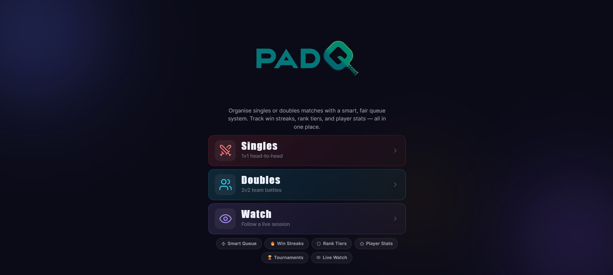
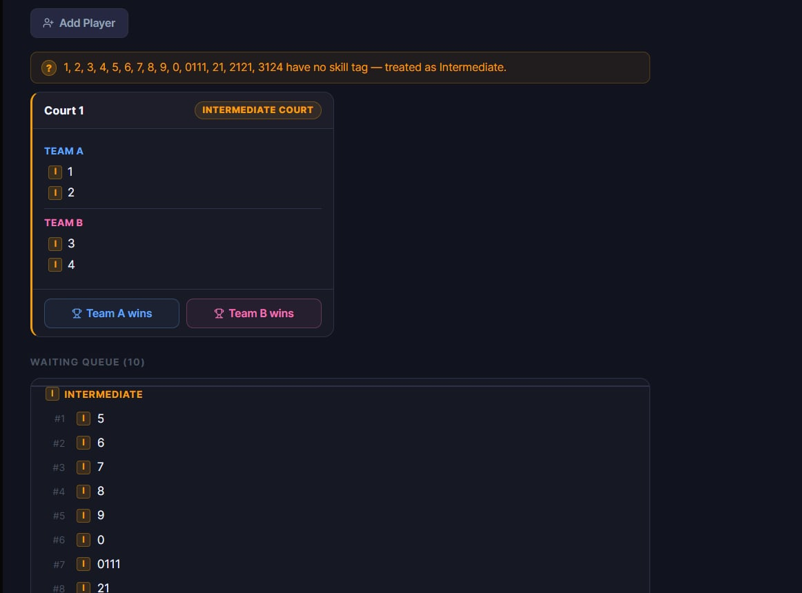
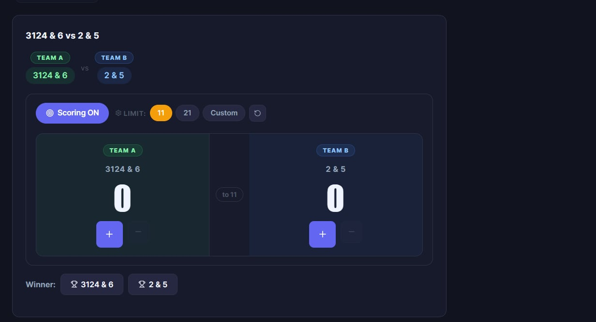
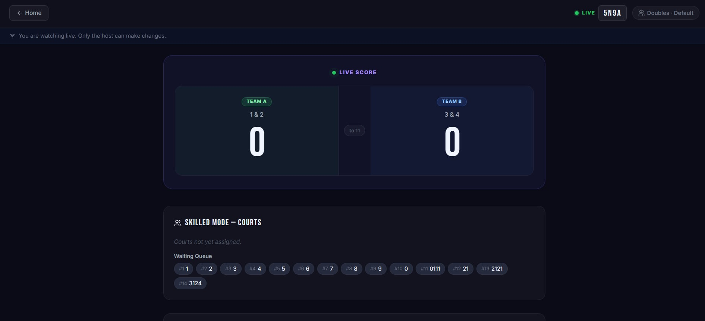
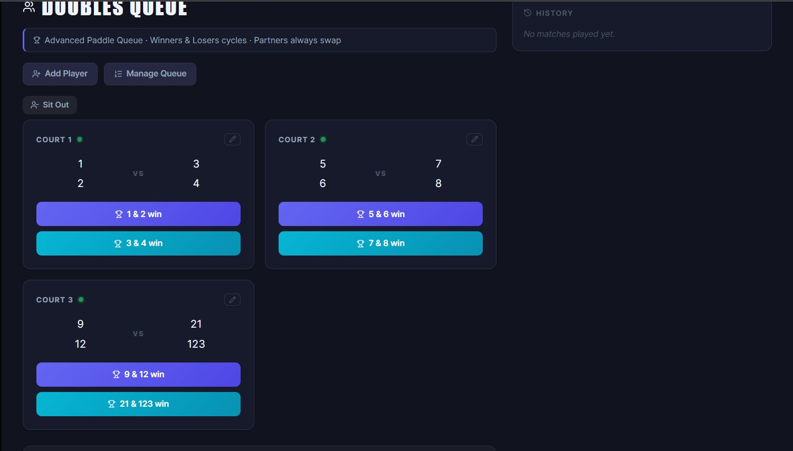
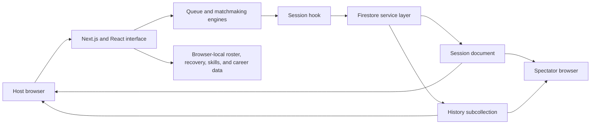

# PAD-Q

<p align="center">
  
</p>

**Real-time queue and matchmaking software for singles and doubles play.** PAD-Q helps a host organize players, rotate matches across one or more courts, record results, and share a live spectator view without requiring viewers to install an application.

[Live demo](https://pad-q.vercel.app) · [GitHub repository](https://github.com/Sceyo/PadQ)

## Project status

PAD-Q is an independently developed product in **active development**. The `main` branch is the focused V1 launch build; the complete experimental feature set is preserved on `codex/all-features-v1-archive`.

- Deployed on Vercel
- Backed by Firebase Cloud Firestore
- 151 application tests and 11 Firestore rules tests currently passing
- Designed for browser-based host and spectator experiences

The project is functional, but it should still be treated as a testing build rather than a production-secure service. Current limitations are documented below.

## The problem

Running a club night or casual sports session becomes difficult when one person has to manually remember:

- who has waited the longest;
- which players or teams have already met;
- who should rotate after a win or loss;
- how to distribute players across several courts;
- which players are sitting out or temporarily absent; and
- how to keep waiting players and spectators informed.

PAD-Q turns those decisions into a shared, real-time workflow. The host manages the session from one browser, while viewers follow the current match, queue, score, history, and statistics through a room code or shared link.

## Key features

### Session management

- Singles and doubles session setup
- Six-character room codes, direct watch links, and QR sharing
- Explicit **Go Live** control before a session is shown to viewers
- Automatic same-browser host recovery through Firebase Anonymous Authentication
- Responsive light and dark interfaces

### Match and court operations

- Default singles and doubles queue rotation
- Shared multi-court assignment for one to three courts
- Shared FIFO multi-court rotation with optional permanent partner pairs
- Point-by-point live scoring with configurable 11- or 21-point targets and deuce handling
- Player sit-out, return, substitution, and “sit next” controls
- Single-step undo for supported match flows
- Saved club roster for faster future setup

### History and analytics

- Timestamped match results and optional scores
- Session win/loss records, win rates, streaks, and rank tiers
- Skill-bracket leaderboards
- Device-local career statistics
- Spectator match history and next-match announcements

## Product preview

### Session entry



The homepage gives players and organizers direct access to singles, doubles, and spectator experiences.

### Shared multi-court matchmaking



The V1 launch flow prioritizes a clear shared waiting queue, fair court assignment, sit-out handling, and optional permanent partner pairs.

### Host scoring



The host can enable point-by-point scoring, select a target score, update either team, and record the winner from the same match view.

### Live spectator view



For a single court, spectators can follow the optional live score. In
multi-court sessions, **Live Court Status** shows who is currently playing on
each court, together with the waiting queue and upcoming assignments, without
requiring the host to enter every point.

### Multi-court management



Multi-court sessions keep active matches visible together so a host can record results and continue player rotation across three courts.

Explore the current build through the [live demo](https://pad-q.vercel.app).

## My role and ownership

PAD-Q is an independent product that I own and develop as **Founder & Full-Stack Developer**. I designed and implemented the product experience, frontend architecture, queue and matchmaking engines, Firestore integration, automated tests, and deployment workflow.

Development has included feedback and code review from other people, along with AI-assisted review and development using Codex and Claude Code. Product ownership and final implementation decisions remain mine.

## Architecture

PAD-Q is a client-heavy Next.js application. Domain logic is kept in TypeScript queue engines, while a session hook and service layer coordinate shared Firestore state.



### Data flow

1. A host action is validated and translated into a queue-engine transition.
2. The resulting session state is sent through `useSession` and `lib/sessionService.ts`.
3. Firestore stores shared state in `sessions/{sessionId}` and results in its `history` subcollection.
4. Real-time `onSnapshot` listeners update connected host and spectator browsers.
5. A completed match uses a revision-checked Firestore transaction so the session update and idempotent history entry commit together without lost updates.

There is no separate REST or GraphQL backend in this repository. The browser uses the Firebase SDK directly, making Firestore rules the effective authorization boundary.

## Technology stack

| Area | Technology | Use in PAD-Q |
|---|---|---|
| Framework | Next.js 16.2.1, App Router | Routing and application structure |
| UI | React 19.2.4 | Interactive host and spectator experiences |
| Language | TypeScript 5 | Typed application and matchmaking logic |
| Data | Firebase 12.11.0 / Cloud Firestore | Persistence and real-time synchronization |
| Testing | Vitest 4.1.9 | Unit and simulation tests |
| Styling | Custom CSS, CSS Modules, Tailwind CSS 4 | Responsive interface and theme styling |
| Tournament logic | `brackets-manager`, `brackets-memory-db` | In-memory bracket management |
| Supporting UI | Lucide React, `qrcode.react` | Icons and session QR codes |
| Deployment | Vercel | Hosted Next.js application |

## V1 matchmaking and rotation

### Default

- **Singles:** king-of-the-court rotation. A winner remains king until defeated or until reaching the three-win rotation limit.
- **Doubles:** an `INIT → WINNERS → LOSERS` state machine seeds the player pool and alternates between winner and loser groups.
- Candidate doubles teams are scored to reduce repeated partners, repeated matchups, immediate replay, and skill imbalance.

### Deferred modes

Tournament, Play-All, skill-based matchmaking, viewer PIN setup, and the legacy independent-court coordinator are hidden from the V1 production interface. Their implementations and documentation remain available on `codex/all-features-v1-archive` for later hardening and release.

The deferred skill engine groups players as Beginner, Intermediate, or Advanced. Court filling follows a priority cascade:

1. four players from one skill group;
2. a majority group plus an adjacent-level player;
3. a split between adjacent skill groups; and
4. a cross-bracket fallback when no closer match can be formed.

Wait-cycle counters provide a starvation override so a smaller skill group is not skipped indefinitely. Rest cycles are calculated from player count and available court capacity.

## Testing and quality assurance

The current Vitest suite reports:

```text
Test Files  8 passed | 1 skipped (9)
Tests       151 passed | 11 skipped (162)
```

The suite focuses on deterministic domain logic and verifies:

- singles king, challenger, fatigue, and forced-rotation behavior;
- doubles phase transitions, partner selection, pool limits, and serialization;
- skill-priority selection, rest cycles, starvation prevention, and idle-court filling;
- player statistics and matchmaking suggestions; and
- club-night simulations with as many as 50 players over repeated rotation cycles.

The simulations check important invariants, including preventing a player from occupying two courts, keeping every player accounted for, bounding player-pool sizes, and ensuring waiting players eventually receive matches.

The repository includes Firestore Emulator rule tests, but does not yet include React component tests, full browser end-to-end tests, or a CI quality gate. ESLint also has unresolved warnings; these are tracked as development limitations rather than hidden behind the passing domain suite.

## Local setup

### Prerequisites

- Node.js 20 or a compatible current LTS release
- npm
- A Firebase project with a Firestore database

### 1. Clone the repository

```bash
git clone https://github.com/Sceyo/PadQ.git
cd PadQ
```

### 2. Install dependencies

```bash
npm install
```

### 3. Configure Firebase

Create a Firebase project, enable Cloud Firestore, enable the **Anonymous** sign-in provider in Firebase Authentication, and register a web application. Add every production and local hostname to the Firebase API key's allowed HTTP referrers. Create `.env.local` in the repository root using placeholder values like these:

```dotenv
NEXT_PUBLIC_FIREBASE_API_KEY=your_firebase_api_key
NEXT_PUBLIC_FIREBASE_AUTH_DOMAIN=your-project-id.firebaseapp.com
NEXT_PUBLIC_FIREBASE_PROJECT_ID=your-project-id
NEXT_PUBLIC_FIREBASE_STORAGE_BUCKET=your-project-id.appspot.com
NEXT_PUBLIC_FIREBASE_MESSAGING_SENDER_ID=your_messaging_sender_id
NEXT_PUBLIC_FIREBASE_APP_ID=your_firebase_app_id
NEXT_PUBLIC_FIREBASE_APP_CHECK_ENABLED=false
NEXT_PUBLIC_FIREBASE_APP_CHECK_SITE_KEY=your_recaptcha_enterprise_site_key
```

Do not commit `.env.local` or paste real project configuration into issues, screenshots, or documentation.

For production, register the web app with Firebase App Check using reCAPTCHA
Enterprise, add the site key in Vercel, then set
`NEXT_PUBLIC_FIREBASE_APP_CHECK_ENABLED=true`. Monitor verified requests before
enabling Firestore enforcement in Firebase Console. Keep the switch false for
unregistered local and preview environments.

Deploy the repository's Firestore rules and indexes to your selected Firebase project:

```bash
npx -y firebase-tools@latest deploy --only firestore:rules,firestore:indexes
```

Review `firestore.rules` and run `npm run test:rules` before using a project that contains real or sensitive data. The rules suite requires Java 21 or newer for the local Firestore emulator.

### 4. Start the development server

```bash
npm run dev
```

Open [http://localhost:3000](http://localhost:3000).

## Available commands

| Command | Purpose |
|---|---|
| `npm run dev` | Start the Next.js development server |
| `npm run build` | Create a production build |
| `npm run start` | Serve the production build |
| `npm run lint` | Run ESLint |
| `npm test` | Run the Vitest suite once |
| `npx tsc --noEmit --incremental false` | Run a standalone TypeScript check without emitting files |

## Deployment

The authoritative go-live sequence and acceptance criteria are maintained in
[`V1-RELEASE-GATES.md`](V1-RELEASE-GATES.md). Gate 1.5 (selective spectator
viewing of the current players on Courts 1–3) and Gate 2 (free-tier capacity and
real-life reliability) are blocking requirements for the official V1 release.

The live application is hosted on Vercel at [pad-q.vercel.app](https://pad-q.vercel.app). A deployment requires the same six Firebase environment variables listed above to be configured in the hosting environment.

Firestore is managed separately:

- `firebase.json` selects the default Firestore database in `asia-southeast1`.
- `firestore.rules` contains database access rules.
- `firestore.indexes.json` currently defines no composite indexes.

The code updates a `lastActiveAt` server timestamp during host activity and detects when a session document disappears. Automatic expiry is **not currently confirmed as enabled**. Firestore TTL expects a TTL field to represent an expiration time, and deletion is not immediate. A correct expiry design and deployed TTL policy remain planned work.

## Known limitations

- **Anonymous host identity:** ownership persists in the same browser, but safe cross-device host recovery requires account linking and is sealed for V1.
- **No guaranteed 30-minute expiry:** activity timestamps exist, but an appropriate expiration timestamp and confirmed deployed TTL policy do not.
- **Browser-local data:** saved rosters, skill assignments, court groups, recovery data, and career statistics are device-specific.
- **Online-first behavior:** explicit offline persistence and conflict recovery are not implemented.
- **Multi-court navigation:** switching between independently stored court sessions can require a page reload.
- **Partial test boundary:** the matchmaking engines and Firestore rules have automated coverage, but UI components and complete user journeys remain incomplete.
- **Open quality findings:** the test suite and build pass; linting still reports warnings.
- **Large controllers:** the main host and spectator pages still contain substantial orchestration logic and would benefit from further decomposition.

## Planned improvements

1. Add optional permanent account linking for safe cross-device host recovery.
2. Separate public spectator data into a dedicated projection if stronger viewer privacy is required.
3. Implement an explicit `expireAt` strategy and enable a verified Firestore TTL policy.
4. Add React component and browser end-to-end tests for host, spectator, scoring, recovery, and multi-court workflows.
5. Add continuous integration for tests, TypeScript, linting, and production builds.
6. Improve offline behavior and visible connection recovery.
7. Complete skilled-mode undo behavior and further separate page orchestration into focused controllers.
8. Add CSV history export, roster import, and configurable singles streak limits.
9. Add a short product demonstration video.

## Usage notice

Copyright © 2026 PAD-Q. All rights reserved.

This repository is publicly available for portfolio review, learning, and evaluation. No license is granted to copy, modify, redistribute, sublicense, or commercially use the source code or product assets without prior written permission from the owner.

This source-visible notice keeps ownership with the creator; it is not an open-source license.

## Contact

- [LinkedIn](https://www.linkedin.com/in/francis-aliser/)
- [Portfolio](https://aliser-portfolio.vercel.app/)
