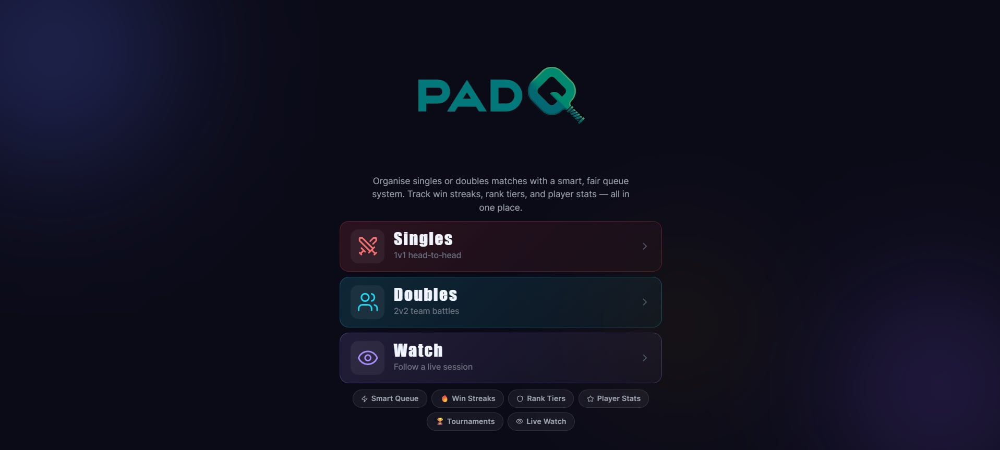
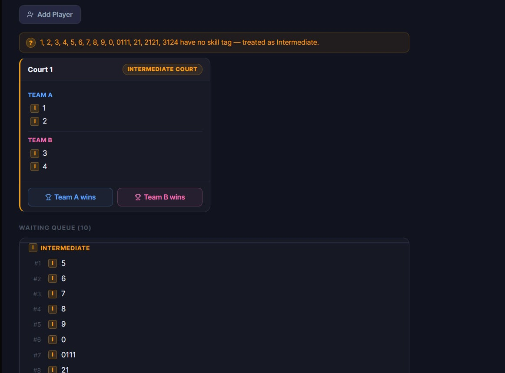
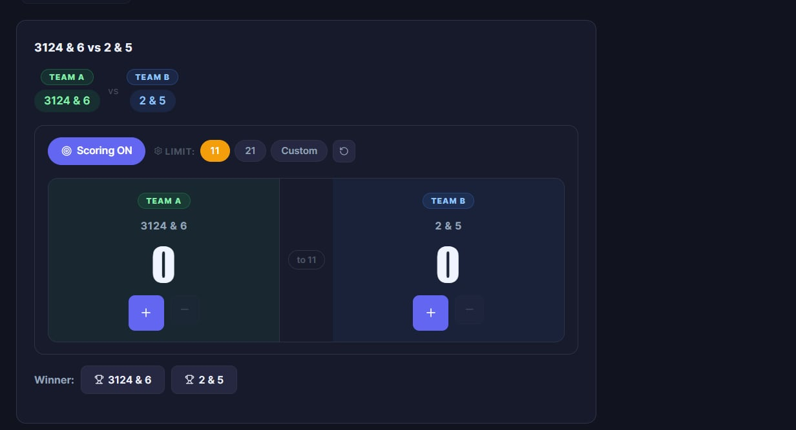
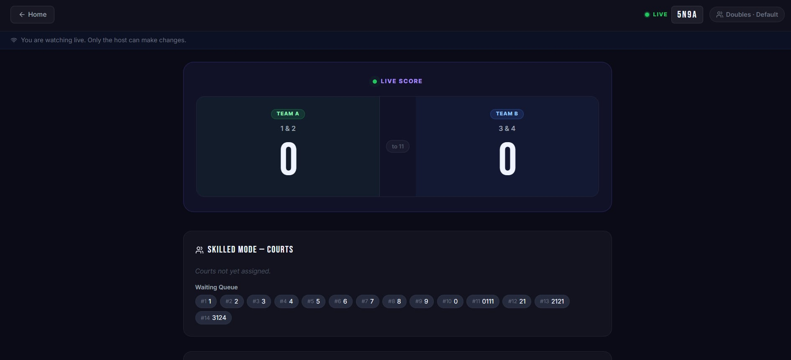
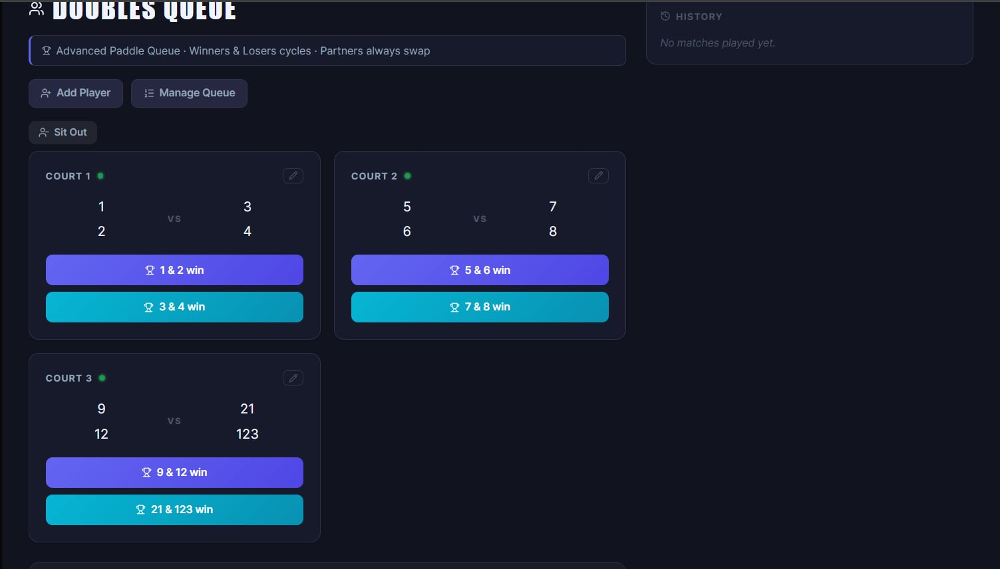
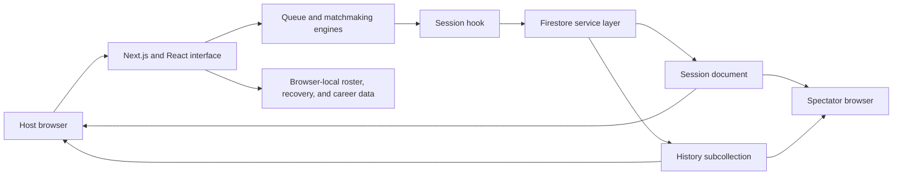

# PAD-Q

<p align="center">
  
</p>

**Real-time queue and matchmaking software for singles and doubles play.** PAD-Q helps a host organize players, rotate matches across one or more courts, record results, and share a live spectator view without requiring viewers to install an application.

[Live demo](https://pad-q.vercel.app) · [GitHub repository](https://github.com/Sceyo/PadQ)

## Project status

PAD-Q is an independently developed product in **active development**. The `main` branch contains the production V1 release; `UI-Overhaul` has been merged into **`Matchmaking-skill-based`** for **V1.2 Skill-Aware Matchmaking** development.

- Production baseline: **`v1.0.0`** (`UI-Overhaul` mobile-first architecture + `Matchmaking-skill-based` V1.2 skill engine)
- Deployed on Vercel with Firebase Cloud Firestore and Firebase App Check enforcement
- **540 passing automated unit, component, simulation, and scenario tests** (plus **4 expected-fail** assertions across 64 Vitest files), **40 Firestore Emulator security/concurrency tests**, and **39 Playwright E2E browser tests**
- Active feature branch: **`Matchmaking-skill-based`** (reviving V1.2 Skill-Aware Matchmaking with UI-Overhaul)
- Protected `main` branch with a required GitHub Actions quality gate
- Designed for mobile-first (`>= 44px` touch targets) and desktop browser-based host and spectator experiences

All architectural and operational documentation is indexed in [`docs/README.md`](docs/README.md).

### V1 operating contract

- Up to **30 players**, **3 courts**, and **30 simultaneous Live Watch viewers**
- One host device and one anonymous session owner
- Temporary event rooms rather than permanent venue or player accounts
- Firebase Spark and Vercel Hobby operation with a **$0 / ₱0 infrastructure target**
- Online-first operation with safe manual retry after a failed result submission

## The problem

Running a club night or casual sports session becomes difficult when one person has to manually remember:

- who has waited the longest;
- which players or teams have already met;
- who should rotate after a win or loss;
- how to distribute players across several courts;
- which players are sitting out or temporarily absent; and
- how to keep waiting players and spectators informed.

PAD-Q turns those decisions into a shared, real-time workflow. The host manages the session from one browser, while viewers follow current court assignments, the queue, completed results, history, and statistics through a room code or shared link. Single-court sessions can also share a live score.

## Key features

### Session management

- Singles (Pool Rotation default or King of the Court) and doubles session setup
- **Smart Roster Paste & Two-Tier Pre-Session Check-In:** Paste Reclub/numbered/bulleted registration lists directly into setup (automatically stripping ordinals and skill tags), check in arriving players in order, and stage remaining registrants into a collapsible **Expected Late Arrivals** accordion in Host Tools with both individual 1-tap `Check In` and batch `Check In All` support
- Six-character room codes, direct watch links, and QR sharing
- Explicit **Go Live** control before a session is shown to viewers
- Automatic same-browser host recovery through Firebase Anonymous Authentication and global fatal-auth resilience recovery
- Responsive light and dark interfaces with mobile-first `>= 44px` touch targets

### Match and court operations

- Default singles and doubles queue rotation with **Singles Pool Rotation** (`INIT → WINNERS → LOSERS`) and **3-win streak cap** across both single-court and multi-court singles
- Shared multi-court assignment for one to three courts (up to 30 players) with team anti-repeat and skill balancing
- **Compact Player Name Formatting & Unified Host Drawer Grids:** Automatically abbreviates multi-word names on display (`Anna Leigh Waters` → `A.L. Waters`, `Lee Chong` → `L. Chong`) across court cards, queue chips, break drawers, late arrival trays, spectator views, and leaderboards while strictly preserving full raw names in state, Firestore, and accessible `title` / `aria-label` attributes
- **Smart Search / Filter in Host Drawers (`> 6` Players):** Automatically reveals a compact search filter (matching both raw full names and abbreviated display names) inside pre-session **Expected Arrivals** (`SetupView`) and live **Host Tools** drawers (**Manage Players On Break**, **Expected Late Arrivals**, and **Set Partners**) whenever more than 6 players are listed
- **Global Asynchronous Partner Pairing (Option 2):** Pair any two players across courts or queue with real-time location tags (`[QUEUE]`, `[COURT 1]`, etc.); queued partners hold their spot without blocking others (non-blocking leapfrog) and unite on the very next open court
- **Multi-Court Match Scoring:** Configurable `Match Scores: ON/OFF` toggle with 1-tap presets (`11–9`, `11–7`, etc.) and custom typing to record game scores directly
- **Live Elapsed Match Timers & Voice Callouts:** Client-side elapsed match timer (`MM:SS`) and 1-tap Web Speech API voice announcements on court cards
- Optional point-by-point live scoring for single-court sessions with deuce logic
- Redesigned CourtCard UI with dedicated Team 1 (Indigo) and Team 2 (Cyan) containers, individual player chips, ampersand connectors, and elevated `VS` badges
- Player sit-out (priority return to front vs return to back), substitution, queue reordering, and “sit next” controls
- Single-step undo for single-court and multi-court match flows
- **Retroactive Match Winner Correction:** Flip a misrecorded match winner directly from Match History with atomic Firestore propagation and full standings recalculation
- Score correction, duplicate-submit protection, failed-save rollback, and refresh persistence
- Saved club roster for faster future setup

### History, spectator alerts, and analytics

- Timestamped match results with score badges and winner indicators
- **Spectator Full Waiting Queue, Deterministic ETAs & Turn Alerts:** Live Watch displays the full waiting queue with deterministic ETA wait badges (`Next Up`, `~10m`, etc.) and **Tap-Your-Name Turn Alerts** (Web Audio chime + vibration when advancing to On Deck or On Court)
- Session win/loss records, win rates, streaks, and rank tiers (plus skill-bracket leaderboards in Skilled mode)
- **4-Tier Deterministic Standings:** Ranked by Wins → Win % → Point Differential (`+/-`) → Opponent Win % (Matchup Strength / OWP)
- **Shareable Stat Cards:** Export or share **Session Standings** and **Individual Player Spotlight** stat cards via native share, clipboard, or PNG download
- Device-local career statistics
- Spectator match history and real-time live court sync

## Product preview

### Session entry



The homepage gives players and organizers direct access to singles, doubles, and spectator experiences.

### Shared multi-court matchmaking



The V1 launch flow prioritizes a clear shared waiting queue, fair court assignment, sit-out handling, and optional permanent partner pairs.

### Host scoring



In a single-court session, the host can enable point-by-point scoring, select a target score, update either team, and record the winner from the same match view. In multi-court sessions, hosts have a **Match Scores** toggle (ON by default): recording a match triggers a clean direct scoring modal with 1-tap presets (`11–9`, `11–7`, etc.) and custom typing to power the Point Differential and Opponent Win % leaderboard, or can be toggled OFF for rapid winner-only recording.

### Live spectator view



For a single court, spectators can follow the optional live score. In multi-court sessions, **Live Court Status** lets a viewer see current court matchups, live pulse indicators, completed scores, and the shared next-player queue in real time without requiring point-by-point entry.

During a live multi-court doubles session, the host can pair any two players across courts or queue using **Global Asynchronous Partner Pairing (Option 2)**. Real-time location tags (`[QUEUE]`, `[COURT 1]`, etc.) clarify where each player is; queued partners hold their spot in line without blocking others and automatically unite as teammates on the next available court.

### Multi-court management



Multi-court sessions keep active matches visible together so a host can record results and continue player rotation across three courts.

Explore the current build through the [live demo](https://pad-q.vercel.app).

## My role and ownership

PAD-Q is an independent product that I own and develop as **Founder & Full-Stack Developer**. I designed and implemented the product experience, frontend architecture, queue and matchmaking engines, Firestore integration, automated tests, and deployment workflow.

Development has included feedback and code review from other people, along with AI-assisted review and development using Codex and Claude Code. Product ownership and final implementation decisions remain mine.

## Architecture

PAD-Q is a client-heavy Next.js application. Domain logic is kept in TypeScript queue engines, while a session hook and service layer coordinate shared Firestore state.


```mermaid
flowchart LR
    Host["Host browser"] --> UI["Next.js and React interface"]
    UI --> Engines["Queue and matchmaking engines"]
    Engines --> Hook["Session hook"]
    Hook --> Service["Firestore service layer"]
    Service --> Session["Session document"]
    Service --> History["History subcollection"]
    Session --> Host
    Session --> Viewer["Spectator browser"]
    History --> Host
    History --> Viewer
    UI --> Storage["Browser-local roster, recovery, and career data"]
```

### Data flow

1. A host action is validated and translated into a queue-engine transition.
2. The resulting session state is sent through `useSession` and `lib/sessionService.ts`.
3. Firestore stores shared state in `sessions/{sessionId}` and results in its `history` subcollection.
4. Real-time `onSnapshot` listeners update connected host and spectator browsers.
5. A completed match uses a revision-checked Firestore transaction so the session update and idempotent history entry commit together without lost updates.

There is no separate REST or GraphQL backend in this repository. The browser uses the Firebase SDK directly, making Firestore rules the effective authorization boundary.

## Technology stack

| Area | Technology | Use in PAD-Q |
|---|---|---|
| Framework | Next.js 16.4.3, App Router | Routing and application structure |
| UI | React 19.2.4 | Interactive host and spectator experiences |
| Language | TypeScript 5 | Typed application and matchmaking logic |
| Data | Firebase 12.19.0 / Cloud Firestore | Persistence and real-time synchronization |
| Testing | Vitest 4.1.11, Playwright | Unit, component, simulation, rules, and E2E browser tests |
| Styling | Custom CSS, CSS Modules, Tailwind CSS 4 | Responsive interface and theme styling |
| Supporting UI | Lucide React, `qrcode.react` | Icons and session QR codes |
| Deployment | Vercel | Hosted Next.js application |

## V1 matchmaking and rotation

### Default

- **Singles (Pool Rotation & King of the Court):** Single-court sessions default to Pool Rotation (`INIT → WINNERS → LOSERS`) with anti-repeat and skill balancing, or can select King of the Court. Both single-court and multi-court singles enforce a 3-win streak rotation cap (`SINGLES_MAX_WIN_STREAK = 3` / `MULTI_COURT_SINGLES_MAX_STREAK = 3`).
- **Doubles:** An `INIT → WINNERS → LOSERS` state machine seeds the player pool and alternates between winner and loser groups across both single-court and multi-court rotations.
- Candidate doubles teams are scored (`formTeams`) to minimize repeated partners, repeated matchups, immediate replay, and skill imbalance (`buildNumericSkillMap`).

### V1.2 Active Development: Skill-Aware Matchmaking

Skill-based matchmaking is being revived and modernized for **V1.2** on the `Matchmaking-skill-based` branch (see [`docs/v1.2/SKILL_AWARE_MATCHMAKING.md`](docs/v1.2/SKILL_AWARE_MATCHMAKING.md)).

The skill engine groups players as **Beginner**, **Intermediate**, or **Advanced**. Court allocation follows a strict priority cascade:

1. **P1 (Pure Match):** Four players from the exact same skill bracket.
2. **P2 (Majority + Adjacent):** Majority bracket filled by immediate neighbor (B+I or I+A; never B+A).
3. **P3 (Split Fill):** Adjacent brackets split 2+2 or 3+1.
4. **P3B (Cross-Bracket Snake):** When no intermediates exist, allow B+A with snake drafting (`Team A: B1 + A2`, `Team B: B2 + A1`).

Wait-cycle counters provide a **starvation override** so a smaller skill group is not skipped indefinitely. In V1.2, court assignments project directly into `courtSlots` so spectators follow live skill-bracket matches in real-time.

Tournament, Play-All, viewer PIN setup, and the legacy independent-court coordinator remain sealed on `all-features-archive` for subsequent releases.

## Testing and quality assurance

The automated test suite includes:

- **540 passing application unit, component, simulation, and scenario tests** (plus 4 expected-fail assertions) across 64 test files (0 unexpected failures);
- **40 Firestore Emulator security and concurrency tests** (run against the Firebase Emulator; skipped cleanly otherwise); and
- **39 passing Playwright browser end-to-end and stress scenarios** across 13 spec files.

The suite focuses on deterministic domain logic and verifies:

- singles pool rotation, king, challenger, fatigue, and 3-win forced-rotation behavior across single and multi-court sessions;
- doubles phase transitions, partner selection, pool limits, anti-repeat team splitting, and serialization;
- **Pre-Session Check-In, Smart Paste & Batch Late Check-In**: Reclub/numbered list parsing, two-tier arrival check-in, collapsible Expected Late Arrivals tab in Host Tools, and atomic `Check In All` capacity-aware batching;
- **Compact Player Name Formatting & Smart Host Drawer Filtering**: pure display-layer abbreviation (`formatDisplayName`) and dual-mode search filtering (`matchesPlayerFilter` above the `> 6` player threshold) across host drawers, spectator views, and analytics with zero mutation of underlying state or Firestore identities;
- **Global Asynchronous Partner Pairing (Option 2)**: cross-court pairs, non-blocking queue holding, court starvation protection, and partner unification;
- **Multi-Court Match Scoring, Flip Winner & Point Differential**: 1-tap preset scores, custom score entry, retroactive match winner flipping with atomic history replacement, and 4-tier tiebreaker sorting;
- **Spectator ETAs, Turn Alerts & Shareable Stat Cards**: deterministic wait-time badges, Web Audio/vibration turn alerts, and Session/Player Spotlight recap cards;
- skill-priority selection (`P1–P3B`), snake-draft ordering, rest cycles, starvation prevention, and idle-court filling;
- prototype pollution hardening and linear regex ReDoS resistance;
- player statistics and matchmaking suggestions; and
- 25- and 30-player rush scenarios, three-court concurrent completion, queue
  removal, score recovery, reconnects, and 30 simultaneous Live Watch viewers.

The simulations check important invariants, including preventing a player from occupying two courts, keeping every player accounted for, bounding player-pool sizes, and ensuring waiting players eventually receive matches.

The repository includes Firestore Emulator rule tests, focused React component
tests for Live Court Status, and browser end-to-end tests against local
Authentication and Firestore emulators. GitHub Actions runs lint, the unit and
scenario suite, the production build, Firestore rules tests, browser/stress
tests, and a production dependency audit. This strict `verify` check is required
before protected `main` can accept a pull request. ESLint has no errors; existing
warnings remain tracked as non-blocking development limitations.

The detailed persona assessment is recorded in
[`V1-PERSONA-ACCEPTANCE-MATRIX.md`](docs/V1-PERSONA-ACCEPTANCE-MATRIX.md).

## Local setup

### Prerequisites

- Node.js 20 or a compatible current LTS release
- npm
- A Firebase project with a Firestore database

### 1. Clone the repository

```bash
git clone https://github.com/Sceyo/PadQ.git
cd PadQ
```

### 2. Install dependencies

```bash
npm install
```

### 3. Configure Firebase

Create a Firebase project, enable Cloud Firestore, enable the **Anonymous** sign-in provider in Firebase Authentication, and register a web application. Add every production and local hostname to the Firebase API key's allowed HTTP referrers. Create `.env.local` in the repository root using placeholder values like these:

```dotenv
NEXT_PUBLIC_FIREBASE_API_KEY=your_firebase_api_key
NEXT_PUBLIC_FIREBASE_AUTH_DOMAIN=your-project-id.firebaseapp.com
NEXT_PUBLIC_FIREBASE_PROJECT_ID=your-project-id
NEXT_PUBLIC_FIREBASE_STORAGE_BUCKET=your-project-id.appspot.com
NEXT_PUBLIC_FIREBASE_MESSAGING_SENDER_ID=your_messaging_sender_id
NEXT_PUBLIC_FIREBASE_APP_ID=your_firebase_app_id
NEXT_PUBLIC_FIREBASE_APP_CHECK_ENABLED=false
NEXT_PUBLIC_FIREBASE_APP_CHECK_SITE_KEY=your_recaptcha_enterprise_site_key
```

Do not commit `.env.local` or paste real project configuration into issues, screenshots, or documentation.

For production, register the web app with Firebase App Check using reCAPTCHA
Enterprise, add the site key in Vercel, then set
`NEXT_PUBLIC_FIREBASE_APP_CHECK_ENABLED=true`. Monitor verified requests before
enabling Firestore enforcement in Firebase Console. Keep the switch false for
unregistered local and preview environments.

Deploy the repository's Firestore rules and indexes to your selected Firebase project:

```bash
npx -y firebase-tools@latest deploy --only firestore:rules,firestore:indexes
```

Review `firestore.rules` and run `npm run test:rules` before using a project that contains real or sensitive data. The rules suite requires Java 21 or newer for the local Firestore emulator.

### 4. Start the development server

```bash
npm run dev
```

Open [http://localhost:3000](http://localhost:3000).

### Safe local Firebase browser testing

Use two PowerShell terminals so browser tests cannot write to production.

Terminal 1:

```powershell
npm.cmd run emulators
```

Terminal 2:

```powershell
$env:NEXT_PUBLIC_USE_FIREBASE_EMULATORS="true"
npm.cmd run dev
```

Set the switch before starting Next.js. If the development server was already
running, stop and restart it. The local Emulator UI is available at
[http://127.0.0.1:4000](http://127.0.0.1:4000).

## Available commands

| Command | Purpose |
|---|---|
| `npm run dev` | Start the Next.js development server |
| `npm run emulators` | Start local Authentication and Firestore for safe browser tests |
| `npm run build` | Create a production build |
| `npm run start` | Serve the production build |
| `npm run lint` | Run ESLint |
| `npm test` | Run the Vitest suite once |
| `npm run test:rules` | Run Firestore security and concurrency tests in the emulator |
| `npm run test:e2e` | Run the full browser and stress suite against local emulators |
| `npx tsc --noEmit --incremental false` | Run a standalone TypeScript check without emitting files |

## Deployment

The authoritative public-release register is
[`V1-PUBLIC-RELEASE-TASKS.md`](docs/V1-PUBLIC-RELEASE-TASKS.md). RC6 has completed
the automated, security, capacity, clean-CI, merge, tag, and production
deployment work. The final go/no-go activity is the supervised event described
in [`V1-SUPERVISED-EVENT-RUNBOOK.md`](docs/V1-SUPERVISED-EVENT-RUNBOOK.md). The
planned scope after launch, including multi-host sessions and V1.2 features, is maintained in
[`PADQ-RELEASE-ROADMAP.md`](docs/PADQ-RELEASE-ROADMAP.md) and [`docs/README.md`](docs/README.md).

The live application is hosted on Vercel at [pad-q.vercel.app](https://pad-q.vercel.app).
A production deployment requires the six Firebase web configuration variables
plus `NEXT_PUBLIC_FIREBASE_APP_CHECK_ENABLED` and
`NEXT_PUBLIC_FIREBASE_APP_CHECK_SITE_KEY`. Preview and local environments should
leave App Check disabled unless their hostnames are separately registered.

Firestore is managed separately:

- `firebase.json` selects the default Firestore database in `asia-southeast1`.
- `firestore.rules` contains database access rules.
- `firestore.indexes.json` currently defines no composite indexes.

The code updates a `lastActiveAt` server timestamp during host activity and detects when a session document disappears. Automatic expiry is **not currently confirmed as enabled**. Firestore TTL expects a TTL field to represent an expiration time, and deletion is not immediate. A correct expiry design and deployed TTL policy remain planned work.

## Known limitations

- **Single host:** V1 has one anonymous session owner. Multi-host management, delegated referees, and safe cross-device ownership transfer are deferred.
- **No guaranteed 30-minute cloud deletion:** activity timestamps and 30-minute inactivity write locks are enforced at the Firestore rules boundary (`isSessionActive` with heartbeat recovery), while physical document TTL deletion remains planned.
- **Browser-local data:** saved rosters, skill assignments, pre-session late arrivals, recovery data, and career statistics are device-specific.
- **Online-first behavior:** a failed authoritative result safely restores the previous state and can be retried manually, but V1 has no durable automatic offline replay queue.
- **Multi-court point-by-point tracking:** V1 provides direct match score entry (1-tap presets and custom scores) to power Point Differential and Opponent Win % tiebreakers, alongside an instant toggle to switch between score entry and rapid winner-only recording. Point-by-point live incrementation remains single-court only.
- **Viewer and court ceiling:** the tested free-tier contract is 30 viewers and 3 courts. PAD-Q does not promise 300-viewer events or four or more courts in V1.
- **Deterministic ETA vs competitive ratings:** Live Watch provides deterministic wait estimates (`~10m`, `~20m` based on queue batching and active court capacity), while Bronze–Diamond tiers summarize session performance and are not external Elo or DUPR ratings.
- **No permanent venue or player accounts:** V1 rooms are temporary, and PAD-Q does not claim certified GDPR compliance or provide cloud player-profile requests.
- **Open quality findings:** the test suite, typecheck, and build pass with 0 ESLint errors; experimental React Compiler warnings remain tracked as non-blocking development items.

## Planned improvements

1. Add secure multi-host roles, delegated court scoring, and cross-device ownership recovery.
2. Add a compact spectator projection and high-fan-out realtime delivery for events beyond 30 viewers.
3. Implement a durable offline result outbox with automatic replay and clearer synchronization status.
4. Implement an explicit `expireAt` strategy and enable a verified Firestore TTL policy.
5. Add persistent venues and optional player accounts with appropriate privacy and deletion controls.
6. Add dynamic match-duration learning to refine deterministic wait estimates over the course of a session.
7. Add opponent-aware Elo/DUPR ratings and tournament rules as separately validated modes.
8. Add CSV history export and configurable win-streak rotation limits.
9. Further decompose the host and spectator controllers and resolve remaining React Compiler lint warnings.

## Usage notice

Copyright © 2026 Francis Aliser. All rights reserved.

PADQ is proprietary software. This repository is publicly visible for review, evaluation, and portfolio purposes. No permission is granted to use, copy, modify, redistribute, sublicense, host, commercially exploit, or create derivative works from the source code or product assets without prior written permission from the copyright holder.

See the [proprietary software notice](LICENSE) for the complete terms. PADQ is not open-source software.

## Author and contact

- **Created and maintained by Francis Aliser**
- [GitHub](https://github.com/Sceyo)
- [LinkedIn](https://www.linkedin.com/in/francis-aliser/)
- [Portfolio](https://aliser-portfolio.vercel.app/)
